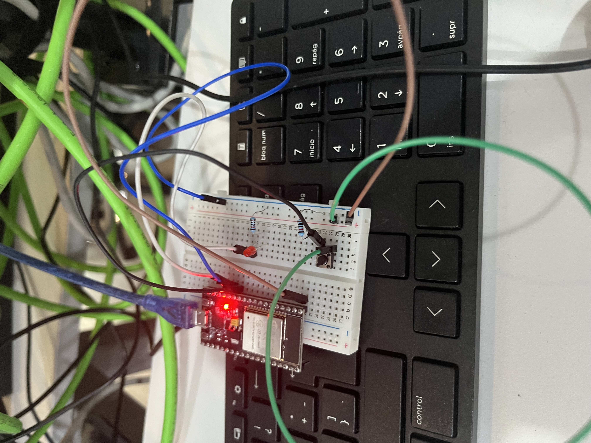

# 📚 Práctica 1: Control de LED con Pulsador (Entrada Digital)

> Un proyecto fundamental para entender cómo un microcontrolador (ESP32) lee información del mundo físico (un botón) y actúa sobre él (un LED).

---

## 1) Resumen

- **Autor:** Juan Carlos Valdés Pérez
- **Asignatura:** Introducción a la Mecatrónica
- **Fecha:** 12/09/2025
- **Placa:** ESP32
- **Descripción breve:** Un circuito simple que utiliza un pulsador (push button) para controlar el encendido y apagado de un LED, demostrando el uso de pines de entrada y salida digital.

> **Nota:** Este proyecto es la base para cualquier sistema de control que requiera leer un interruptor, un sensor de límite o cualquier señal digital simple.

---

## 2) Objetivo del Proyecto

Aprender a configurar los pines de un ESP32 para dos modos diferentes:

- **Modo SALIDA (OUTPUT):** Para enviar voltaje y encender un LED usando la función `digitalWrite()`.
- **Modo ENTRADA (INPUT):** Para leer el estado de un componente externo, en este caso un pulsador, usando la función `digitalRead()`.

---

## 3) Componentes y Requisitos

**Hardware**
- Microcontrolador ESP32
- 1 LED (cualquier color)
- 1 Resistencia de 220 Ohms (para proteger el LED)
- 1 Pulsador (push button)
- Protoboard y Jumpers (cables)

**Software**
- Arduino IDE
- Lenguaje de programación: C++

---

## 4) Desafíos Clave y Aprendizajes

**Desafío:**
El desafío más común al inicio fue entender la polaridad del LED. Al conectarlo al revés (ánodo y cátodo invertidos), el circuito no funcionaba aunque el código estuviera perfecto.

**Aprendizaje:**
El aprendizaje clave fue la **importancia de verificar el hardware** antes de asumir que el error está en el software (código). También aprendí a diferenciar claramente entre `pinMode(INPUT)` y `pinMode(OUTPUT)`, que son la base para controlar casi cualquier componente.

---

## 5) Galería y Demostración

