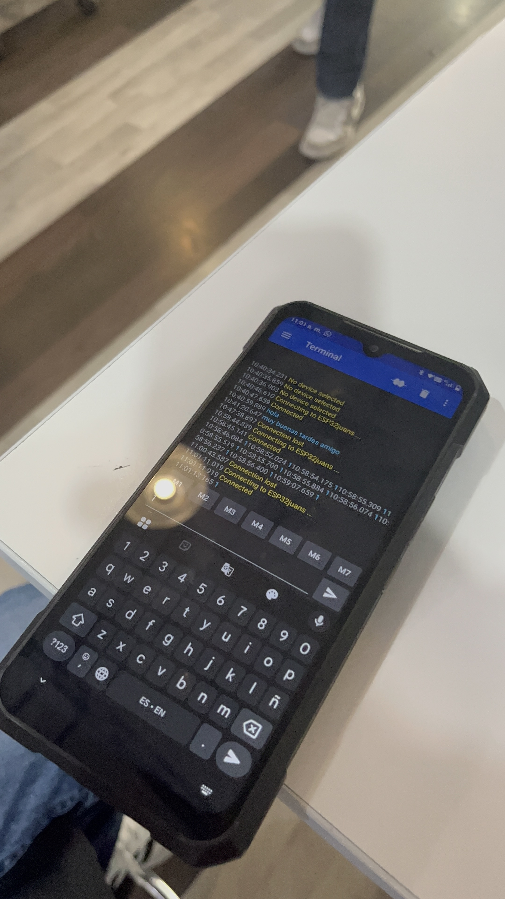

# 📚 Práctica 2: Control de LED por Bluetooth (Comunicación Serial)

> Un proyecto que introduce la comunicación inalámbrica, usando el módulo Bluetooth integrado del ESP32 para recibir comandos desde un teléfono móvil y controlar un LED.

---

## 1) Resumen

- **Autor:** Juan Carlos Valdés Pérez
- **Asignatura:** Introducción a la Mecatrónica
- **Fecha:** 12/09/2025
- **Plataforma:** ESP32 (Bluetooth)
- **Descripción breve:** Se establece una comunicación serial por Bluetooth entre un ESP32 y una app de terminal en un teléfono Android para enviar comandos ('1' y '0') que encienden o apagan un LED.

> **Nota:** Este proyecto es la puerta de entrada para crear proyectos de "Internet de las Cosas" (IoT), control robótico móvil o cualquier sistema que requiera control remoto.

---

## 2) Objetivo del Proyecto

El objetivo fue aprender los conceptos básicos de la **comunicación serial** y cómo implementarla de forma **inalámbrica** usando la librería `BluetoothSerial.h` del ESP32. El fin era recibir datos (caracteres '1' y '0') desde un dispositivo externo (teléfono) para ejecutar acciones en el microcontrolador.

---

## 3) Componentes y Requisitos

**Hardware**
- Microcontrolador ESP32
- 1 LED (cualquier color)
- 1 Resistencia de 220 Ohms
- Protoboard y Jumpers (cables)

**Software**
- Arduino IDE
- Lenguaje de programación: C++ (con la librería `BluetoothSerial.h`)
- App Móvil (Android): **Serial Bluetooth Terminal**

---

## 4) Desafíos Clave y Aprendizajes

**Desafío:**
El mayor desafío fue la compatibilidad de plataformas. Mi teléfono personal (iOS) no era compatible con la aplicación "Serial Bluetooth Terminal" requerida. El problema se solucionó **gracias al trabajo en equipo**, utilizando el teléfono Android de mi compañero para realizar la vinculación Bluetooth y las pruebas de envío de comandos.

**Aprendizaje:**
Mi principal aprendizaje fue descubrir el potencial de una terminal serial. Antes había usado plataformas cerradas (como Arduino Cloud), pero vi que trabajar directamente con una terminal Bluetooth te da **muchísima más libertad y menos restricciones**. Entendí que esto abre más posibilidades para crear interfaces de control personalizadas en el futuro.

---

## 5) Código Clave

Aquí está el fragmento de código del ESP32 que "escucha" los datos que llegan por Bluetooth.

```bash
#include "BluetoothSerial.h"

BluetoothSerial SerialBT;
byte led = 12; // Pin donde está conectado el LED

void setup() {
  Serial.begin(115200);
  SerialBT.begin("El Tlacoyo"); // Nombre del dispositivo Bluetooth
  pinMode(led, OUTPUT);
}

void loop() {
  // Revisa si hay datos esperando en el buffer de Bluetooth
  if (SerialBT.available()) {
    // Lee el dato entrante como un String
    String mensaje = SerialBT.readString();
    Serial.println("Recibido: " + mensaje);

    // Compara el mensaje recibido
    if (mensaje == "1") {
      digitalWrite(led, 1); // Prende el LED
      Serial.println("On");
    } else if (mensaje == "0") {
      digitalWrite(led, 0); // Apaga el LED
      Serial.println("Off");
    }
  }
  delay(1000); // Pequeña pausa
}

```
---
## 5) Galería y Demostración


