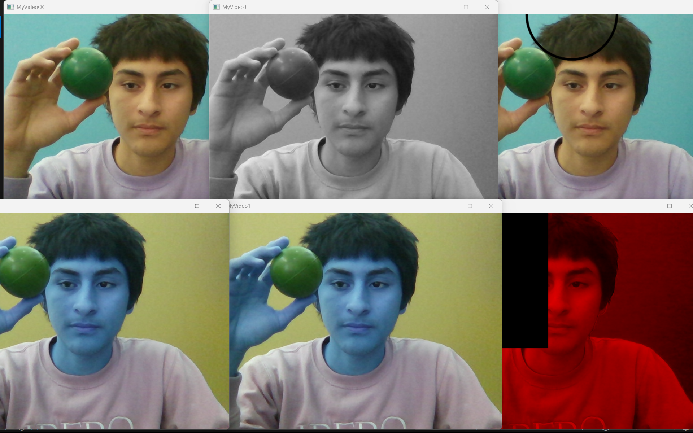

# 🎨 [Fundamentos de Visión Artificial: Colores y Figuras]

*Introducción a la manipulación de canales de color y dibujo de primitivas en tiempo real.*

---

## 🎯 Objetivo Principal

El propósito de esta práctica fue introducirme en el procesamiento de imágenes con **OpenCV**.
El objetivo específico fue aprender a descomponer una imagen de video en sus canales de color fundamentales (Azul, Verde, Rojo) para manipularlos individualmente, además de entender el sistema de coordenadas de la imagen para dibujar figuras geométricas y realizar animaciones sencillas.

## 📸 Demostración

En la siguiente imagen se observa la manipulación de canales en tiempo real. Se eliminaron los componentes Azul y Verde (dejando solo el Rojo) y se dibujó una región "ciega" (cuadro negro).


## 🛠️ Tecnologías y Librerías

**Software:**
* **Python 3:** Lenguaje principal.
* **OpenCV (`cv2`):** Para la captura de video, conversiones de color y dibujo.
* **NumPy:** Para la manipulación eficiente de las matrices de la imagen (arrays).

**Hardware:**
* Cámara Web (Webcam integrada o externa).

## 🏗️ Lógica y Procesamiento

El programa opera dentro de un bucle infinito (`while True`) procesando cada fotograma capturado:

1.  **Conversión de Espacios de Color:**
    * OpenCV captura nativamente en **BGR**.
    * Se realizaron conversiones a **RGB** (para visualización estándar) y **Escala de Grises** (`COLOR_BGR2GRAY`) para simplificar el procesamiento.

2.  **Dibujo y Animación:**
    * **Línea:** Se dibuja una línea estática negra usando `cv2.line`.
    * **Círculo Animado:** Se dibuja un círculo usando `cv2.circle`. Su posición en X (`centrox`) se incrementa en cada iteración del bucle, creando una animación de desplazamiento horizontal. Al llegar al límite (300px), se reinicia.

3.  **Filtrado de Canales (La "Magia" de los Arrays):**
    * Se accede directamente a la matriz de la imagen para "apagar" canales específicos.
    * `img[:, :, 0] = 0`: Elimina el canal Azul.
    * `img[:, :, 1] = 0`: Elimina el canal Verde.
    * **Resultado:** La imagen resultante (`no_blue`) se ve roja. También se creó una Región de Interés (ROI) negra poniendo todos los valores a 0 en un rango de pixeles `[0:300, 0:300]`.

## 💻 El Código

```python
import cv2

# Iniciar captura de video (0 = webcam predeterminada)
video = cv2.VideoCapture(0)

# Variables para la animación
centrox = 0
centroy = 0

while True:
    ret, img = video.read()
    
    if not ret:
        break

    # --- 1. Conversiones de Color ---
    image1_rgb = cv2.cvtColor(img, cv2.COLOR_BGR2RGB)
    image2_rgb = cv2.cvtColor(img, cv2.COLOR_RGB2BGR)
    image3_rgb = cv2.cvtColor(img, cv2.COLOR_BGR2GRAY) # Escala de grises
    
    cv2.imshow("MyVideoOG", img)

    # --- 2. Dibujo y Animación ---
    draw = img.copy()
    # Línea estática
    cv2.line(draw, (0,0), (100,100), (0,0,0), thickness=3, lineType=cv2.LINE_AA)
    # Círculo en movimiento (usa la variable centrox)
    cv2.circle(draw, (centrox, centroy), 100, (0,0,0), thickness=3, lineType=cv2.LINE_AA)
    
    cv2.imshow("MyVideodraw", draw)

    # Lógica de movimiento del círculo
    if centrox < 300:
        centrox = centrox + 1
    else:
        centrox = 0
        
    # --- 3. Manipulación de Canales (Filtro Rojo) ---
    no_blue = img.copy()
    no_blue[:, :, 1] = 0  # Eliminar canal Verde (Green)
    no_blue[:, :, 0] = 0  # Eliminar canal Azul (Blue)
    
    # Crear un cuadro negro (ROI) en la esquina
    no_blue[0:300, 0:300, 2] = 0 

    # --- 4. Visualización ---
    cv2.imshow("MyVideo1", image1_rgb)
    cv2.imshow("MyVideo2", image2_rgb)
    cv2.imshow("MyVideo3", image3_rgb)
    cv2.imshow("MyVideoCOLOR", no_blue)
    
    if cv2.waitKey(1) & 0xFF == ord('q'):
        break

video.release()
cv2.destroyAllWindows()
```
## 6) Galería y Demostración

