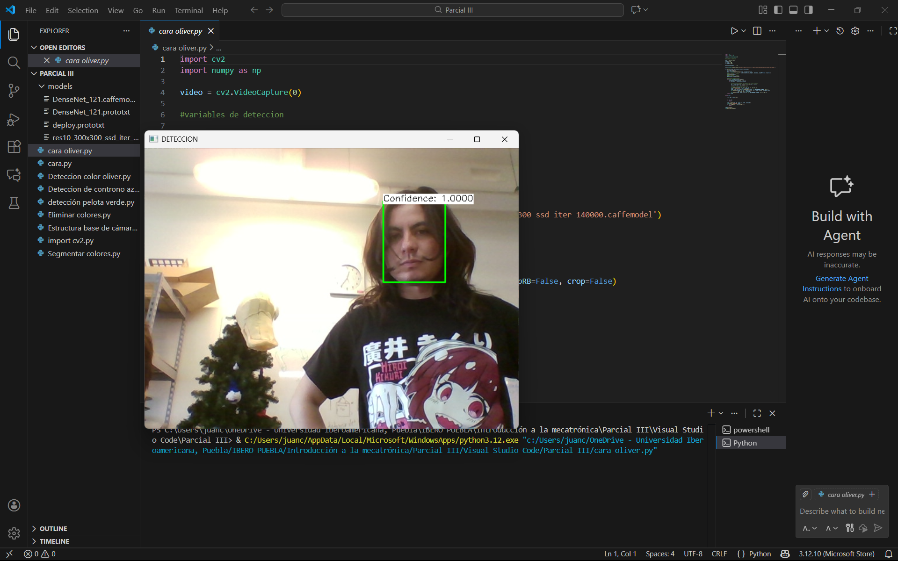

# 🤖 [Visión Artificial: Detección de Rostros con DNN]

*Implementación de redes neuronales (SSD) pre-entrenadas para detección facial de alta precisión.*

---

## 🎯 Objetivo Principal

El objetivo de esta práctica fue avanzar más allá del procesamiento de imágenes básico y adentrarme en el **Deep Learning**.
Específicamente, aprendí a utilizar el módulo `dnn` (Deep Neural Networks) de OpenCV para cargar un modelo Caffe pre-entrenado. Esto resuelve el problema de la detección de rostros con mucha mayor robustez y estabilidad que los métodos antiguos (como Haar Cascades), incluso en condiciones de luz variable o ángulos difíciles.

## 📸 Demostración

En la imagen se observa cómo el algoritmo identifica el rostro del usuario y dibuja una "Bounding Box" (caja delimitadora) verde, mostrando además el nivel de confianza (probabilidad) de que sea una cara (en este caso, 100% o 1.0000).



## 🛠️ Tecnologías y Librerías

**Software:**
* **Python 3**
* **OpenCV (`cv2`):** Específicamente el módulo `cv2.dnn`.
* **NumPy:** Para operaciones matemáticas con las detecciones.

**Modelos de IA (Archivos externos):**
* `deploy.prototxt`: La arquitectura de la red neuronal.
* `res10_300x300...caffemodel`: Los "pesos" o el entrenamiento de la red (Single Shot Detector - SSD).

## 🏗️ Lógica y Procesamiento

El código sigue un flujo de inferencia de red neuronal:

1.  **Carga del Modelo:** Se inicia la red (`net`) cargando la arquitectura y el modelo entrenado desde archivos externos.
2.  **Pre-procesamiento (Blob):**
    * Las redes neuronales no leen imágenes "normales", necesitan un "Blob".
    * La función `cv2.dnn.blobFromImage` se encarga de redimensionar la imagen a 300x300 píxeles y realizar la resta media (`mean subtraction`) de los canales de color (104, 117, 123) para normalizar la iluminación.
3.  **Inferencia (Detección):**
    * Se pasa el blob a la red y se obtiene una lista de detecciones.
4.  **Filtrado y Dibujo:**
    * Se recorren todas las detecciones encontradas.
    * **Filtro:** Solo se toman en cuenta aquellas cuya "confianza" (confidence) sea mayor al 99% (`0.99`).
    * **Escalado:** Las coordenadas que entrega la red están normalizadas (de 0 a 1), por lo que se multiplican por el ancho y alto original del video para saber dónde dibujar el cuadro en la pantalla.

## 💻 El Código

```python
import cv2
import numpy as np

# Iniciar captura de video
video = cv2.VideoCapture(0)

# --- Configuración del Modelo ---
# Valores medios de los canales de color (para normalización)
mean = [104, 117, 123]
scale = 1.0
in_width = 300
in_height = 300

# Umbral de confianza (Solo mostrar si está 99% seguro de que es una cara)
detection_threshold = 0.99

# Cargar la red neuronal desde los archivos del modelo Caffe
net = cv2.dnn.readNetFromCaffe('models/deploy.prototxt', 'models/res10_300x300_ssd_iter_140000.caffemodel')

def detect(frame, net, scale, in_width, in_height):
    h = frame.shape[0]
    w = frame.shape[1]
    
    # Convertir la imagen a un "blob" (formato que entiende la red neuronal)
    blob = cv2.dnn.blobFromImage(frame, scalefactor=scale, 
                                 size=(in_width, in_height), mean=mean, swapRB=False, crop=False)
    
    # Pasar el blob a la red
    net.setInput(blob)
    # Obtener las detecciones (Forward pass)
    detections = net.forward()

    # Procesar las detecciones encontradas
    for i in range(detections.shape[2]):
        confidence = detections[0, 0, i, 2]
        
        # Filtrar detecciones débiles
        if confidence > detection_threshold:
            
            # Extraer las coordenadas del bounding box y escalarlas al tamaño original
            box = detections[0, 0, i, 3:7] * np.array([w, h, w, h])
            (x1, y1, x2, y2) = box.astype('int')
            
            # Dibujar el rectángulo verde
            cv2.rectangle(frame, (x1, y1), (x2, y2), (0, 255, 0), 2)
            
            # Etiqueta con el % de confianza
            label = 'Confidence: %.4f' % confidence
            label_size, base_line = cv2.getTextSize(label, cv2.FONT_HERSHEY_SIMPLEX, 0.5, 1)
            
            # Fondo blanco para el texto
            cv2.rectangle(frame, (x1, y1 - label_size[1]), (x1 + label_size[0], y1 + base_line),
                          (255, 255, 255), cv2.FILLED)
            # Texto
            cv2.putText(frame, label, (x1, y1), cv2.FONT_HERSHEY_SIMPLEX, 0.5, (0, 0, 0))
            
    return frame

while True:
    ret, img = video.read()
    
    if not ret:
        break

    # Llamar a la función de detección
    img2 = detect(img, net, scale, in_width, in_height)    
    
    cv2.imshow('DETECCION', img2)
    
    if cv2.waitKey(1) & 0xFF == ord('q'):
        break

video.release()
cv2.destroyAllWindows()
```
